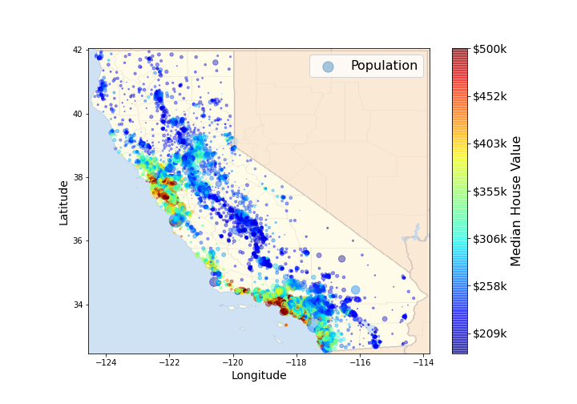

# California Housing Anomaly Detection

The [California Housing Prices](https://www.kaggle.com/datasets/camnugent/california-housing-prices) pertain to the houses found in a given California district and some summary stats about them based on the 1990 census data.

To detect houses with prices that were unsuitable or for other reasons, the anomaly detection method was used. Anomaly detection does not have a specific metric, so different models were trained to compare their results. The models used are as follows:
- DBSCAN
- Isolation Forest
- Local Outlier Factor
- Elliptic Envelope
- One-Class SVM (OCSVM)
